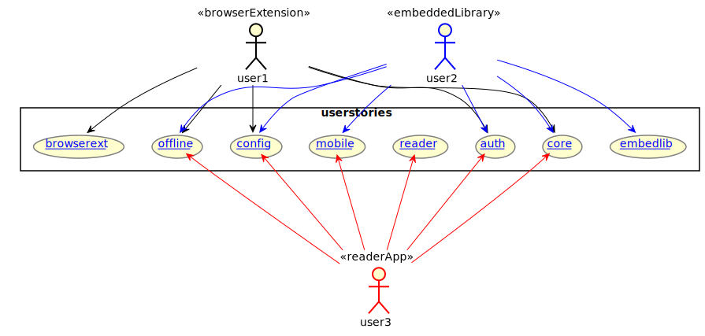

## Products

### Browser Extensions
The Browser Extensions for Chrome, Safari and Firefox which work with any text anywhere on the desktop only. The [webextension](https://github.com/alpheios-project/webextension) repository contains the code enables Alpheios 
to act as a browser extension. It relies on the Alpheios modules for most Alpheios functionality, and itself contains the code for embedding itself in the browser toolbar, menus and content pages.

### Alpheios Embedded Library

The Embedded library allows text providers to enable Alpheios functionality to be embedded directly in their pages without requiring users to install the Alpheios browser extension to access it.

The [embed-lib](https://github.com/alpheios-project/embed-lib) repository contains the code for embedding the Alpheios
library in a specific HTML page.  It relies on the Alpheios modules for most Alpheios functionality, and itself 
contains the API code for embedding Alpheios in any HTML page.

### Alpheios Reader Application
The Alpheios Reader Application will be an Alpheios-hosted Reading Environment implemented as a Progressive Web Application.

Various prototypes for this are underway.  The [pwa-prototype](https://github.com/alpheios-project/pwa-prototype) repository contains a prototype prototype mobile UI served as a progressive web application, relying on the Alpheios modules for core Alpheios functionality. The [alpheios-nemo-ui](https://github.com/alpheios-project/alpheios_nemo_ui) is a Python Flask Application which serves text content. It uses the Alpheios embedded library to provide Alpheios core functionality.  

## User Stories

***(Open the diagram in a new tab to activate the links to the user stories)***

## Core Libraries

[alpheios-data-models](https://github.com/alpheios-project/data-models) contains core data model objects

[alpheios-components](https://github.com/alpheios-project/components) contains ui components and controllers and supporting libraries

[alpheios-inflection-tables](https://github.com/alpheios-project/inflection-tables) contains inflection table data and supporting libraries

[alpheios-lexicon-client](https://github.com/alpheios-project/lexicon-client) driver and adapter for interaction with the alpheios lexicon services (dictionary lookups)

[alpheios-morph-client](https://github.com/alpheios-project/morph-client) contains the driver and adapter for interaction with the alpheios morphology services (morphology and some short defs)

[alpheios-res-client](https://github.com/alpheios-project/res-client) contains the driver and adapter for interaction with the grammar resources

[alpheios-experience](https://github.com/alpheios-project/experience) is the framework for recording user interactions

[alpheios-lemma-client](https://github.com/alpheios-project/lemma-client) contains the driver and adapter for interaction with the alpheios translation service (not yet activated)

[alpheios-node-build](https://github.com/alpheios-project/node-build) is a set of common libraries for building and optimizing the code

These modules are dependencies for the higher level Alpheios products. Each of these modules contains various dependencies on 
3rd party libraries. 

## Web Services

### Morphology Services

### Lexicon Services

### Grammars

## Other Supporting Code

### CapiTainS

...

### Gardener

...

