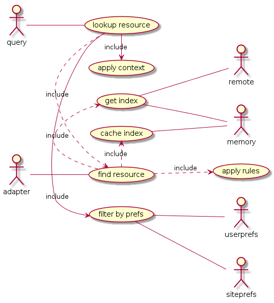
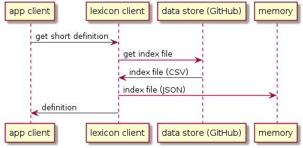
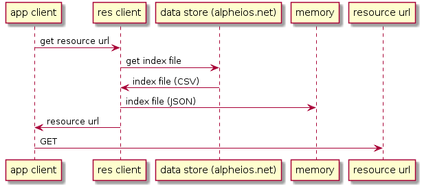

# Alpheios Data Services

## General Use Case

Given a _target_ and a _context_  we need to find a corresponding _resource_. 

_Resources_ may be filtered through _user preferences_ and and _site preferences_.

Resource-specific _rules_ may be applied to the _target_ and _context_ to retrieve the correct _resource_.

Resource retrieval should be cacheable for offline use.

Resource index files vary in size and complexity.

## Participants

_targets_: word, grammatical feature

_context_: the language, the words before and after, the url of the page, page metadata

_resources_: grammars, lexicons, annotations (treebanks, translation alignments, commentary, etc.)

_user preferences_: preferred lexicon, annotation restrictions, etc.  

_site preferences_: site-specific resources (e.g. a specific lexicon to be used for a specific page or text)

_rules_: resource-specific business logic. (e.g. algorithms for finding the correction location in a resource for a given target and context)

## Current Implementations

