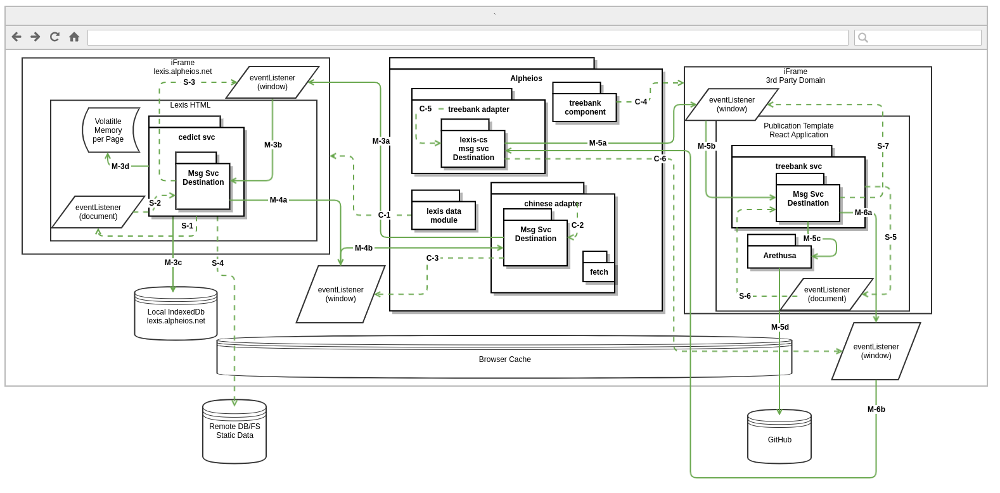

# Alpheios Data Services

## General Use Case

Given a _target_ and a _context_  we need to find a corresponding _resource_. 

_Resources_ may be filtered through _user preferences_ and and _site preferences_.

Resource-specific _rules_ may be applied to the _target_ and _context_ to retrieve the correct _resource_.

Resource retrieval should be cacheable for offline use.

Resource index files vary in size and complexity.

## Participants

_targets_: word, grammatical feature

_context_: the language, the words before and after, the url of the page, page metadata

_resources_: grammars, lexicons, annotations (treebanks, translation alignments, commentary, etc.)

_user preferences_: preferred lexicon, annotation restrictions, etc.  

_site preferences_: site-specific resources (e.g. a specific lexicon to be used for a specific page or text)

_rules_: resource-specific business logic. (e.g. algorithms for finding the correction location in a resource for a given target and context)

## Current Implementations

*Lexicon Short Definition Lookup*

*Lexicon Full Definition Lookup*

*Grammar Index Lookup*

## Lexis-CS Phase 1 

*Lexis-CS and Client Adapters*

"XHR" style interactions are in Orange, "Lexis-CS" style in Green

### XHR Style

In the prior XHR style, the Client Adapters use Fetch to retrieve resources.

The Client Adapter makes an initial request (M-1a) to retrieve a data index file, and the results get put in Volatile Storage.

Subsequent requests for that index (M-1b) retrieve the data from Volatile Storage.

The Client Adapter also requests data from remote services (M-2). These results don't get stored anywhere (not explicitly true -- parts get stored with user data, but that's outside of the scope of this diagram)

All requests that leave the browser may instead be fulfilled by the Browser Cache, at the browser's discretion.

## Lexis-CS Style

### Client Side Instantiation

The Lexis Data Module adds an IFrame with source lexis.alpheios.net to the page. (C-1)

The Chinese Adapter instantiates a Messaging Service with a WindowIFrameDestination configured for CEDICT (C-2)

The Messaging Service adds an Event Listener to the Window to listen to messages from the Service (C-3)

### Service Side Instantiation

The Cedict Service in the HTML of the IFrame adds an Event Listener to the Document (S-1)

The Event Listener instantiates a Messaging Service with a WindowIFrameDestination configured for CEDICT (S-2)

The Messaging Service adds an Event Listener to the Window to listen to messages from the Client (S-3)

The Cedict Service Retrieves data from the Remote DB/FS and populates either Volatile Storage or the Local IndexedDb with the results (S-4). The data retrieval may be intercepted and fulfilled by the Browser Cache.

### Messages

The Chinese Adapter (Client) calls a method of the Messaging Service to post a message to the IFrame (M-3a)

The Event Listener of the Messaging Service on the IFrame Window receives the message and sends it to the Cedict Service (M-3b)

The Cedict Service responds to the message by retrieving data from either the LocalIndexedDb(M-3c) or Volatile Storage (M-3d)

The Cedict Service calls a method of the Messaging Service to post a message to the Client parent window (M-4a)

The Event Listener of the Messaging service on the Client parent window receives the message and executes the message callback of the Chinese Adapter (M-4b)

## Lexis-CS Phase 2 (new services)

*With Treebank Service*

(https://go.gliffy.com/go/share/s7p3ckwkabxlf1tlsni8)

### Client Side Instantiation

The Treebank Component adds an IFrame to the page (domains will vary dependending upon document). (C-4)

The Treebank Adapter instantiates a Messaging Service with a Treebank Destination (C-5)

The Messaging Service adds an Event Listener to the Window to listen to messages from the Treebank Service (C-6)

### Service Side Instantiation

The Treebank Service in the React App in the IFrame adds an Event Listener to the Document (S-5)

The Event Listener instantiates a Messaging Service with a Treebank Destination (S-6)

The Messaging Service adds an Event Listener to the Window to listen to messages from the Client (S-7

### Messages

The Treebank Adapter (Client) calls a method of the Messaging Service to post a message to the IFrame (M-5a)

The Event Listener of the Messaging Service on the IFrame Window receives the message and sends it to the Treebank Service (M-5b)

The Treebank Service calls the Arethusa API (M-5c) which retrieves data from GitHub (M-5d)

The Treebank Service initiates the response by calling a method of the Messaging Service to post a message to the Client parent window (M-6a)

The Event Listener of the Messaging service on the Client parent window receives the message and executes the message callback of the Treebank Adapter (M-6b)

## Index File Sizes

Current largest is approx 7MB, average size is smaller, but multiple per language and resource type
