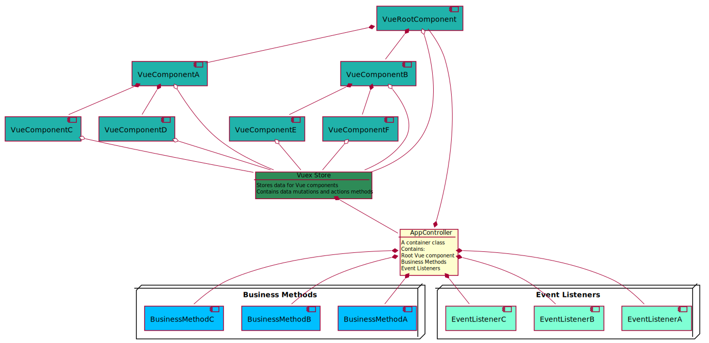

# Application Architecture

Application is a generic term to designate a software that performs a group of similar tasks. An application can take
any form: it can be a webextension or a macOS app extension, a PWA, or an embedded library. An application is not
necessarily a standalone software piece. It's more an umbrella term. An application can run in some kind of controlled 
environment (as in case of webextension), or within some other application (as an embedded lib do). But it can also 
be a a standalone application as well as in case with Safari app extension container app.

Building blocks of an applications are components. A typical app can contain business components, Vue components, and
Vuex store(s).

## Business Components

### What a Business Component is

A business component is a component that implements specific pieces of business logic and stores data related to that
function. A business component usually do not have any UI elements that presents data to the user. It's main purpose 
is to store and process data, not to display it. Vue components are responsible to present data gathered by business
components to the user.

A business component is usually implemented as a single JS class. Each component class should inherit from either a 
**BusinessComponent** class or from some other class that is descendant of a **BusinessComponent**. This will
guarantee that each business component will implement all props and methods that are common for all business
component classes. This is required in order to work with all business components in a uniform way.

Business components are specialized: each single business component should serve a single purpose only.

An example of a business component could be a class that builds an inflection table structure out of inflection data.
This data can be used by a presentational Vue component to present an inflection table to the user.

### Business Components Architecture

Here is a current architecture of business components. Components with browser-specific code are highlighted
with light blue.

It would be beneficial to make the following changes into an architecture:
1. Reduce the number of components with browser-specific code.
2. Simplify interdependencies between components.

The following changes may help to achieve this goal:
* Split ContentProcess component between Content and UIController components. Browser specific part of its
functionality (an interaction with a background script or app) could go into a Content component, and 
page specific functionality (listening of user actions such as clicks) could be inserted into a
UIController. It is more a UIController responsibility to react to user actions.
* Eliminate ownership of stateless resources (i.e. morphologycal analyzer and other language resource 
adapters) with the relationship using a Singleton pattern where a UI controller would call a static
function on an adapter class and that function will return a reference to a single instance of a controller.

An updated architecture is shown below, browser-specific classes are shown in blue.

### Business Component Lifecycle Phases

A business component goes through different lifecycle phases during its existence.

* **unexisting** - a business component has not been created yet.

* **created** - an instance of a business component has been created with the **new** operator by its constructor. 
However, component does not have enough data to be fully functional yet and is not in an active state. Creation of a 
business component should not involve any operations that are lengthy or require significant amounts of memory to be
allocated. Business components can be created by other components during their creation in a chain-like sequence 
and the whole sequence shall be fast and easy on memory. We might not use a component immediately after it is 
created and so it's often better to postpone any expensive initialization operations for later.

* **initialized** - component has enough data to serve its purpose. However, it is not in an active state yet.

* **activated** - component is fully initialized and activated: it listens to the incoming requests or function calls 
and is ready to process and serve data. It is fully functional.

* **deactivated** at this stage component is in "out of service" mode. It does not handle neither any incoming requests 
nor any function calls and either ignores them or return an error message. It is in a sleeping state. Usually it is still
fully initialized, but it might also discard some of its data in order to reduce its memory footprint. If component 
decides to discard some of its data it is a responsibility of a component to restore this data when it will be switched 
back to an **activated** state.

#### Component Lifecycle Diagram

### Lifecycle State Indicators

Each business component should implement the following properties that will reflect a state of it:

* **isInitialized** - whether a component is in an initialized state.

* **isAcivated** - whether a component is in an activated state.

* **isDeactivated** - whether a component has been temporary deactivated.

### State Control Methods

These methods switches business components from one state to the other. As such switching can be of an asynchronous
nature (such as requests to some external resources) all state control methods are asynchronous. They return a promise
that is resolved when a component is switched to a new state successfully and is rejected if state switching failed.
However, for simple components state control methods can be implemented as synchronous. In such cases they
should be called with an `async: false` flag.

* **init()** - switches component to the **initialized** state. This method is usually called on components that
are in the **created** state. Initialization can be a lengthy process as it can involve slow requests to remote
resources. So if the component is required to be available immediately, and its initialization can take time, 
it should be initialized in advance.

* **activate()** - switches component to the **active** state. When run on an already initialized component, should 
be executed fast as all it does is just enables component listeners to the incoming requests. When used
on a component that is in a **created** state, it is responsibility of an **activate()** method to initialize a component
first. As initialization can a lengthy process, an activation can be a lengthy operation too. Also, if a component has 
been deactivated before and some component data has been scrapped in order to free memory, an activation method should
restore this data back.

* **deactivate()** - puts component into a sleeping state. Component may remove some of its data from memory
to minimize its footprint. In this state component is fully or partially initialized.  In partial initialization state
same data can be missing as it has been discarded in order to reduce a component memory consumption. Deactivated
component is ignoring any requests or function calls that are sent to it. Component should either ignore them or 
return an error message to the caller.

## UI Controller

UI Controller is responsible for managing all interactions with the user. It outputs all visual information to
the user and listens to user inputs.

UI Controller structure is modular to accommodate requirements of different applications that will use it.
It consists of the following parts:

* **Vuex store**. Contains data that is required for Vue components so that they can present data for the user. 
This element exists in all UI Controller configuration, except when there is no UI Components at all. 
It is tightly coupled with a UI controller itself. UI Controller keeps a reference to Vuex and Vuex has 
a reference to UI Controller. Mutations and actions
of a Vuex store may call business logic methods of a UI Controller directly.

* **Vue components** display data to the user and listens to user interactions. Vue components keep a
reference to a Vuex store, but not to the UI Controller directly. If Vue component need to notify about
its state update, it calls mutations or actions of a store. Those, in turn, may call methods of a
UI Controller. Individual Vue components have access to all Vuex store properties, but uses only those
ones that are within a component's domain of responsibility.

* **Business functions**. These are methods of a UI Controller that implements business logic. They exist in
any configuration of a UI Controller. If a configuration of a UI controller does not use some methods, it
simply does not call them.

* **Event listeners**. UI Controller might subscribes to get information about events it's interested in.
Those could be user interactions with the page (i.e. mouse double click) that are not handled by
Vue components. Or they can be events from queries initiated by a UI Controller (i.e. LexicalQuery
results). Depending on configuration, UI Controller can have zero to multiple event listeners.

UI Controller follows a business component lifecycle phases.

### UI Controller Architecture

### Interaction with Queries

UI Controller uses queries to retrieve lexical and other information from remote sources. 

Because Queries deal with remote sources, they are asynchronous by nature. To obtain some data with the help
of the Query, UI Controller calls an asynchronous `getData()` method of the Query instance and subscribes 
to listen to Query events. When the Query receives a next portion of data, it fires a corresponding event. 
UI Controller receives event-related data in an event callback, processes the data received, and displays 
this data to the user.

