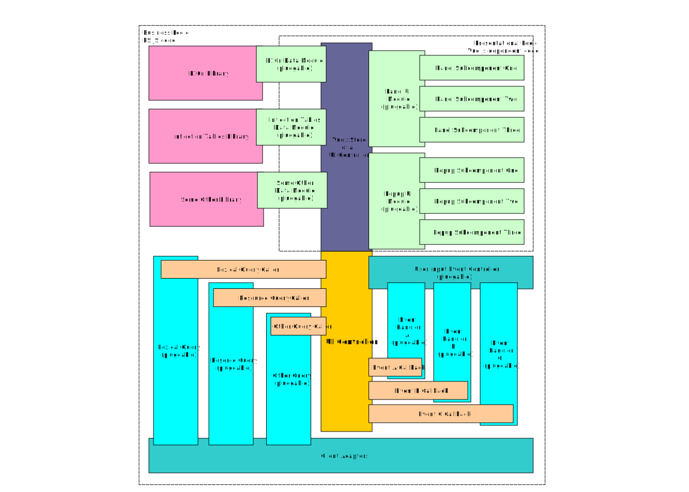

# Application Architecture

Application is a generic term to designate a software that performs a group of similar tasks. An application can take
any form: it can be a webextension or a macOS app extension, a PWA, or an embedded library. An application is not
necessarily a standalone software piece. It's more an umbrella term. An application can run in some kind of controlled 
environment (as in case of webextension), or within some other application (as an embedded lib do). But it can also 
be a a standalone application as well as in case with Safari app extension container app.

Building blocks of an applications are components. A typical app can contain business components, Vue components, and
Vuex store(s).

## Business Components

### What a Business Component is

A business component is a component that implements specific pieces of business logic and stores data related to that
function. A business component usually do not have any UI elements that presents data to the user. It's main purpose 
is to store and process data, not to display it. Vue components are responsible to present data gathered by business
components to the user.

A business component is usually implemented as a single JS class. Each component class should inherit from either a 
**BusinessComponent** class or from some other class that is descendant of a **BusinessComponent**. This will
guarantee that each business component will implement all props and methods that are common for all business
component classes. This is required in order to work with all business components in a uniform way.

Business components are specialized: each single business component should serve a single purpose only.

An example of a business component could be a class that builds an inflection table structure out of inflection data.
This data can be used by a presentational Vue component to present an inflection table to the user.

### Business Components Architecture

Here is a current architecture of business components. Components with browser-specific code are highlighted
with light blue.

It would be beneficial to make the following changes into an architecture:
1. Reduce the number of components with browser-specific code.
2. Simplify interdependencies between components.

The following changes may help to achieve this goal:
* Split ContentProcess component between Content and AppController components. Browser specific part of its
functionality (an interaction with a background script or app) could go into a Content component, and 
page specific functionality (listening of user actions such as clicks) could be inserted into a
AppController. It is more a AppController responsibility to react to user actions.
* Eliminate ownership of stateless resources (i.e. morphologycal analyzer and other language resource 
adapters) with the relationship using a Singleton pattern where a UI controller would call a static
function on an adapter class and that function will return a reference to a single instance of a controller.

An updated architecture is shown below, browser-specific classes are shown in blue.

### Business Component Lifecycle Phases

A business component goes through different lifecycle phases during its existence.

* **unexisting** - a business component has not been created yet.

* **created** - an instance of a business component has been created with the **new** operator by its constructor. 
However, component does not have enough data to be fully functional yet and is not in an active state. Creation of a 
business component should not involve any operations that are lengthy or require significant amounts of memory to be
allocated. Business components can be created by other components during their creation in a chain-like sequence 
and the whole sequence shall be fast and easy on memory. We might not use a component immediately after it is 
created and so it's often better to postpone any expensive initialization operations for later.

* **initialized** - component has enough data to serve its purpose. However, it is not in an active state yet.

* **activated** - component is fully initialized and activated: it listens to the incoming requests or function calls 
and is ready to process and serve data. It is fully functional.

* **deactivated** at this stage component is in "out of service" mode. It does not handle neither any incoming requests 
nor any function calls and either ignores them or return an error message. It is in a sleeping state. Usually it is still
fully initialized, but it might also discard some of its data in order to reduce its memory footprint. If component 
decides to discard some of its data it is a responsibility of a component to restore this data when it will be switched 
back to an **activated** state.

#### Component Lifecycle Diagram

### Lifecycle State Indicators

Each business component should implement the following properties that will reflect a state of it:

* **isInitialized** - whether a component is in an initialized state.

* **isAcivated** - whether a component is in an activated state.

* **isDeactivated** - whether a component has been temporary deactivated.

### State Control Methods

These methods switches business components from one state to the other. As such switching can be of an asynchronous
nature (such as requests to some external resources) all state control methods are asynchronous. They return a promise
that is resolved when a component is switched to a new state successfully and is rejected if state switching failed.
However, for simple components state control methods can be implemented as synchronous. In such cases they
should be called with an `async: false` flag.

* **init()** - switches component to the **initialized** state. This method is usually called on components that
are in the **created** state. Initialization can be a lengthy process as it can involve slow requests to remote
resources. So if the component is required to be available immediately, and its initialization can take time, 
it should be initialized in advance.

* **activate()** - switches component to the **active** state. When run on an already initialized component, should 
be executed fast as all it does is just enables component listeners to the incoming requests. When used
on a component that is in a **created** state, it is responsibility of an **activate()** method to initialize a component
first. As initialization can a lengthy process, an activation can be a lengthy operation too. Also, if a component has 
been deactivated before and some component data has been scrapped in order to free memory, an activation method should
restore this data back.

* **deactivate()** - puts component into a sleeping state. Component may remove some of its data from memory
to minimize its footprint. In this state component is fully or partially initialized.  In partial initialization state
same data can be missing as it has been discarded in order to reduce a component memory consumption. Deactivated
component is ignoring any requests or function calls that are sent to it. Component should either ignore them or 
return an error message to the caller.

## UI Controller

UI Controller is responsible for managing all interactions with the user. It outputs visual information to
the user and listens to user inputs.

### UI Controller Architecture

UI Controller structure is modular to accommodate requirements of different applications that will use it.
All modules in a controller are pluggable. It means that UI Controller should be able to function with
an arbitrary number of modules, or, if necessary, without any modules at all (although this scenario would probably 
not make much sense). Because of this, UI Controller should properly handle situations when not all modules are present.

UI Controller consists of the following parts:

* **Modules**. Module are independent object entities that perform certain roles. All modules
communicate via a Vuex store. There are two types of modules: **UI Modules** and **Data Modules**.

* **Vuex Store**. This is a common bus for passing data between UI controller and registered modules.

* **User Input Event listeners**. UI Controller might subscribes to get information about events it's interested in.
Those could be user interactions with the page (i.e. mouse double click) that are not handled by
Vue components. Depending on configuration, UI Controller can have several event listeners, or no event
listeners at all.

UI Controller follows a business component lifecycle phases.

### Modules

Modules serve as containers for presentational logic (UI modules) or as adapters for business logic
libraries (data modules). As UI modules use Vue.js components and Vuex serves as an inter-component
communication bus, all modules are dependent on a stack of technologies of Vue.js.

Vue.js is a great framework that provides an easy way to create powerful UI objects. A use of Vue.js
greatly reduces amount of manual work that has to be applied to make feature-rich UI components.
On the other hand, a strong dependency on a third-party library introduces risks. If the library be
abandoned, the whole UI part will need to be redone. 

To minimize such risks, we should keep an amount of Vue.js dependent code (i.e. all the code that is 
implemented within modules) to the minimum. Such code should be limited to presentational logic only.
All business logic should be contained within business logic libraries (such as L10n or Inflections)
and not within modules. Modules should stay as lightweight as possible. That will minimize an amount
of work that will be required in case we will need to move our UI components to some other UI framework.

#### UI Modules

UI modules display visual components, listen to user interactions, and redraw themselves when data that
they display is updated. UI modules request data from data modules. UI Modules communicate with other 
UI modules or with data modules using Vuex store's getters, actions, or methods that are installed
on the components globally.

#### Data Modules

Data modules are adapters that make business logic libraries (such as L10n, Inflections, and others) available
to the UI modules. Because Vuex serves as a communication bus between all modules, the role of data modules
is to expose methods and data of business logic libraries to the Vuex store so that UI modules could access it.

Data modules are just wrappers around business logic libraries. Data modules should have no business logic inside them.
Their purpose is just to translate requests from other modules to corresponding methods of business logic 
libraries and updated data when those requests are processed.

If there is a need to provide some business functionality that data modules do not have, such functionality
should be implemented within a business logic library, not within its data module. Data modules should stay
being a wrapper around all business logic methods of libraries be nothing more than that.

In an architecture like this data modules should be very lightweight.

#### Inter-module communication

Data and UI modules exposes two interfaces that are used for inter-module communications: Vuex store
module (exposes data and method to manipulate this data) and a module's public API (exposes general-purpose methods). 
Vuex module is integrated into the common Vuex store that is owned
by a UI controller. Module's public API is integrated into a shared `api` object of a UI controller.
Both Vuex store and an `api` object can be shared with any module or any UI component (i.e a Vue component). 

##### Vuex store module interface

Vuex provides a variety of ways to communicate between components. Those includes store properties, getters,
mutations, and actions. Vue.js mixins and plugins can provide additional ways to install data properties
and methods on components.

Many different ways of communication provide great flexibility. It is, however, can be a source of confusion, too.
If we want to reduce complexity, we should set conventions that will limit inter-component communication to
certain ways only. Probably the best choice could be Vuex getters and actions, along with optional global
methods installed by plugins. The optimal choice of communication methods depends on application architecture
and its needs and is often a subject of opinionated choice. That's why it's good to provide some thoughts on
reasons behind the choice being made above. 

Here is a review of different communication methods with their pros and cons:
* **Direct state props access** ([documentation](https://vuex.vuejs.org/guide/state.html)): 
This is an easiest way to access data from the store, but it may present maintainability problems in some scenarios. 
Once a prop is removed or its format is changed, it will require a change
in all components that use this prop. In order to prevent this a prop can be masked with getters.
* **Store getters** ([documentation](https://vuex.vuejs.org/guide/getters.html)): 
Not as easy to implement as direct props access, getters, on the
other hand, provide a level of isolation between props and their consumers. If prop is changed, 
we can update its getter to return data in a format that is still compatible with all its existing consumers. 
This allows to prevent changes of all consumers upon prop removal or its format change that otherwise 
would be necessary. The use of getters also simplifies tracking of who uses data and in what ways as getters 
can be monitored easily. This is a great advantage in complex applications.
* **Store mutations** ([documentation](https://vuex.vuejs.org/guide/mutations.html)): 
Store mutations are used to save data to the store. They 
isolate properties from data consumers, but, unfortunately, they do not allow addition of any logic related 
to the update. They also do not support asynchronous updates. The more universal way to propagate updates are actions.
* **Actions** ([documentation](https://vuex.vuejs.org/guide/actions.html)): 
actions are similar to mutations, but they are asynchronous. They also allow
creation of some logic related to data updates that will run before or after data updates. That makes them 
more flexible than mutations, at the price of insignificant complexity increase.
* **Mixins** ([documentation](https://vuejs.org/v2/guide/mixins.html)): mixins allow 
to install additional props and methods to the components. The
problem with mixins, however, is that they require component level code to be installed. That contradicts with
our goals of adding modules transparently to the component, in some automated way. Also, an aggressive use of mixins makes code 
less maintainable as props and methods added by mixins are hard to track across the code. Mixins can be
especially dangerous because of its merge feature that is especially tricky to follow. It can change 
(especially with global mixins) how components behave in some ways that can be hard to predict, 
especially in complex applications. These are the reasons why use of mixins is not recommended.
* **Plugins** ([documentation](https://vuejs.org/v2/guide/plugins.html)): 
plugins allow to install props and instance methods on components globally. A difference with mixins is 
that while mixins allow to install props and methods either on selected components of globally (not recommended!), 
plugins install functions to all Vue.js components available within the app. The use of plugins 
is handy and justified when we need to provide global presence of methods, such as in situations when a 
method will be used by all, or almost all, Vue components (i.e. L10n methods). This simplifies development as
every component will have the same instance methods available to it. To avoid naming collisions and
to provide a clear way to identify a module that installs methods, method names should be prefixed with
module names. However, public API methods is probably a more controlled way to expose methods to UI components
and other JS objects.

##### Module's public API

Module's public API is a set of methods of a module that are publicly exposed to other modules or UI components.
It is integrated into a Vue instance with a `provide` option. In order to be accessed in a UI component
a component has to claim its use with `inject`.

#### Namespacing

All modules are namespaced. Each module has its name, and all its props, getters, mutations, and actions, when
inserted into the global Vuex store, prefixed with the module name 
([documentation](https://vuex.vuejs.org/guide/modules.html)). Global methods installed by plugins are
prefixed with a module name is well, as a convention. That allows:
1. Avoid accidental collisions between props or functions from different modules.
2. Provide understanding of which module provides a certain method.

An example of a prefixed action is `l10n/setLocale` (the module name being `l10n` here and `setLocale` being
an action name). This prefixing is done automatically by Vue.js once store module is declared as namespaced.

An example of a prefixed global method installed by a plugin is `$l10nSetLocale`. The module name here is `l10n`
and the method itself is `setLocale`. The `$` prefix designates a method as being global, according to Vue.js
naming convention.

#### Module registration

In order to become usable and available to other modules, each module has to be registered with a UI controller.
UI controller provides a special method for that. Once registered, a module will be instantiated with its object
constructor and then integrated into a shared Vuex store that is maintained by a UI controller. At this moment
a module becomes available to other modules.

Because Vuex modules support dynamic registration, each module can be registered and un-registered dynamically.
This functionality is not implemented at the moment, however, because there is no use cases for it yet.

#### Module dependencies

Modules can be dependent on each other. For example, a UI component may need an L10n module to get access to
translated strings. In such cases a UI component will be unfunctionable if L10n module is not available.

To prevent situations like that, there is a dependency checking mechanism that can be built into components. 
Each component or module knows its dependencies. Once such component is created, it checks if its dependencies 
are satisfied or not. In the latter case a component will report an error that will list all required modules 
that are missing. This serves as a safety net in preventing component malfunction if not all modules it 
depends upon are there.

#### Vuex store module and public API usage

|   | Vuex store module  | Public API module  |
|---|---|---|
| Use from a UI component: | this.$store.state.moduleName.propName  | this.moduleName.methodName()  |
| Use from a root Vue instance:  | this.$options.store.state.moduleName.propName  | this.$options.api.moduleName.methodName()  |
| Use from any JS object:  | uiController.store.state.moduleName.propName  | uiController.api.moduleName.methodName()  |
| Claim as a dependency in a UI component:  | storeModules["moduleName"] or nothing  | inject["moduleName"]  |

### How a UI controller interacts with Queries

UI Controller uses queries to retrieve lexical and other information from remote sources. 

Because Queries deal with remote sources, they are asynchronous by nature. To obtain some data with the help
of the Query, UI Controller calls an asynchronous `getData()` method of the Query instance and subscribes 
to listen to Query events. When the Query receives a next portion of data, it fires a corresponding event. 
UI Controller receives event-related data in an event callback, processes the data received, and displays 
this data to the user.

