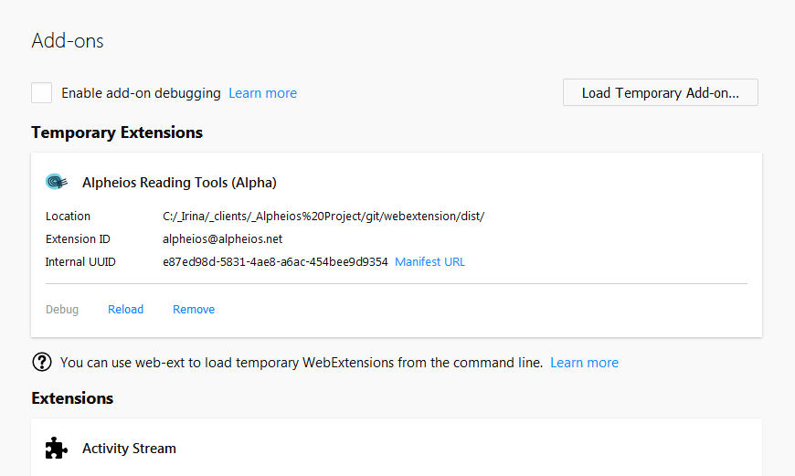
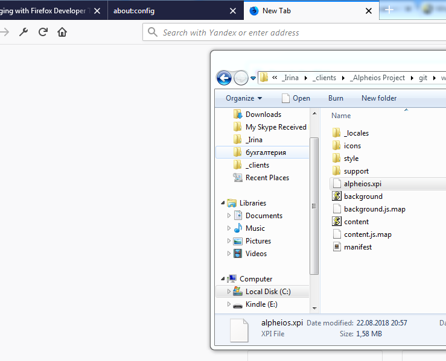
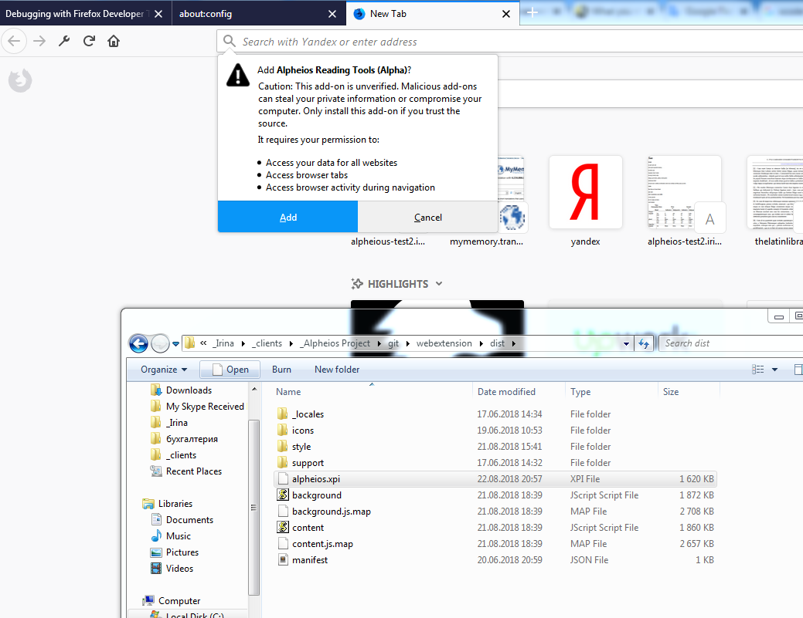
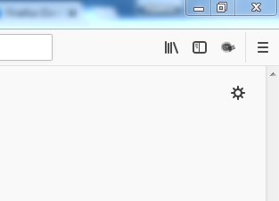

# How To Install a webextension to Firefox (not signed on)

Firefox does now verify that the add-ons you install have been signed by Mozilla, digitally
([details here](https://support.mozilla.org/en-US/kb/add-on-signing-in-firefox)).

That's why you have two ways to use unsigned add-ons.

## Install a Webextention as a Temporary Extension

You could simply upload a webextension using **about:debugging** page of Firefox.
   In this case you don't need any special edition of Firefox and special settings to config properties.
   
   

## Install a Webextention as a Permanent Extension

1. You need to use on of the special editions of Firefox (you could install it from one of the following links):

- [Firefox Extended Support Release (ESR)](https://www.mozilla.org/en-US/firefox/organizations/)
- [Firefox Developer Edition](https://www.mozilla.org/ru/firefox/developer/)
- [Nightly versions of Firefox](https://www.mozilla.org/en-US/firefox/63.0a1/releasenotes/ )

2. You should open the page with config options - **about:config**, click button **I accept the risk!** and change `xpinstall.signatures.required` to **false** by double mouse click on the line:

3. You should create one archive zip file with an extension `*.xpi` with all webextension files (I have done it with the help of 7zip):

4. You should simply drag it to Firefox:

5. Click **Add** in a popup window:

6. And Finally it will appear in a browser

and on a page **about:addons** as any other signed on extension:

