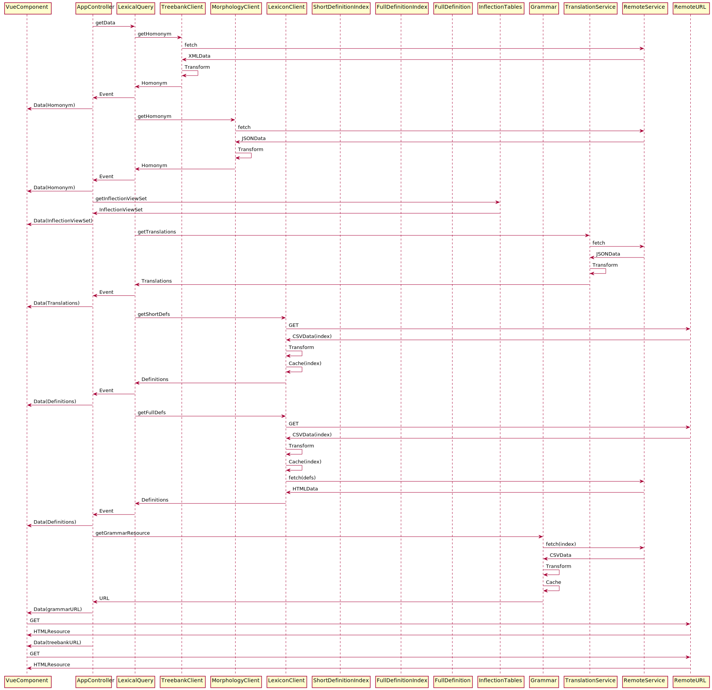

# Design for Managing Offline Content

## Requirements Overview
The [Reader User Stories](https://github.com/alpheios-project/documentation/blob/master/design/reader-user-stories.csv) call for various data and content served by the application to be available fully or partially while offline.

**App Level Content/Data**

 * text pages
 * morphology service data
 * treebank data 
 * short definition data 
 * full definition data 
 * inflection tables 
 * grammar pages

**User Level Content/Data**
 * word lists
 * commentary
 * bookmarks
 * text pages
 * plus various other possibilities for the future including treebank data, images, sound files, etc.

Another way to look at this data is by use case:

* Text Retrieval
* Lexical Queries
* User Data Queries

The User Stories call for the user to be able to precache certain resources (in whole or part) according to their needs.

But we need to be aware that we cannot guarantee the amount of space avaliable for our offline content on the user's devices. Each browser imposes different restrictions. Chrome and Firefox allow a percentage of free space and Safari has a fixed limit of 50MB (these limits may be subject to change). So whatever solution we devise must take into account the need for caching partial datasets and all functionality must be able to have fallback strategies to retrieve data from online sources if it is missing in the offline cache.

Another scenario to consider is if and how cached data is synced for a user across devices.

### Data Sizes

* The lexicon short definition files range from .3MB to 7MB per lexicon.
* The lexicon full definition indeices range from .1BM to over 5MB per lexicon.
* The minified js which contains the full set of inflection table data is currently nearly 1MB

*Estimates still need to be prepared for all other data sources.*

## Current Strategies for Client Side Caching
Currently, the PWA prototype uses no pre-caching of this data and requests for text and lexical query data are cached via the CacheAPI on a per-request basis. The app javascript itself is the only thing that is currently pre-cached.

The LexicalQuery code calls upon a number of remote services to retrieve data. Some data is kept in memory as Javascript objects but no other client-side caching strategy is used.  There are some optimizations we could make to the existing code to reduce memory usage (for example, combining short definition and full definition index files, moving full definition index files to the server elminating the need for the full definition index, moving all definition index functionality to the server) but it makes sense to examine these in the context of the overall need for a strategy for offline content.
 
This [article](https://developers.google.com/web/fundamentals/instant-and-offline/web-storage/offline-for-pwa) recommends that we use the CacheAPI only for the static network resources needed to load the app (i.e. the core javascript, css, icons, and use IndexedDB for all dynamic data.

## Data Sources and Design Discussion

### Text

For the most part, the source data for the texts we will publish for the Reader are TEI/XML files.(User-supplied texts may be supplied as plain text but could be transformed into TEI/XML if need be). These could be served in a number of ways:

* as static HTML files
* as dynamically produced HTML files
* as XML in response to a remote service call
* as HTML in response to a remote service call 

The navigation user stories require that we provide an interface to navigate the text tables of contents, and these tables of contents could also be served in a number of ways:

* as static HTML files
* as dynamically produced HTML files
* as JSON in response to a remote service call

For the PWA Prototype we used a simple approach of just having a few static HTML files providing the demo text content. We didn't implement any text navigation features. We could consider a static page approach for the Reader Application but it would require the development of workflow tools to generate the HTML content from the source XML in a scalable manner (as new texts are added or texts are corrected), and we would need to build a text navigation interface. 

We have an implementation of a [DTS API](https://distributed-text-services.github.io/specifications/) which serve the texts and tables of contents as raw data. The desired long term approach for the reader application may be to build a native Javascript reader which retrieves text via calls to the DTS API. 

However it may be beneficial to start by using the existing [Nemo Python/Flask application framework](https://github.com/alpheios-project/alpheios_nemo_ui) which provides a dynamic text navigation and reading environment as a web application. We could make this into a progressive web application to serve the text content. 

Both the DTS API and the Nemo Application are part of the [Capitains Framework](http://capitains.org/) which already has workflow support for validating and publishing texts from GitHub repositories. Work is also already being done by other users of this framework to integrate with ElasticSearch for search and to add  side-by-side facing translations, etc. We might be able to take advantage of some of those efforts.

Building a native Javascript reader would lend itself more naturally to using an IndexedDb approach to caching the text content for offline use, whereas using either the Flask application or static HTML pages lends itself more to use of the CacheAPI.

### Lexical Query

Currently almost all Lexical Query data is retrieved from remote services. The current flow of data is something like the following:

### User Data

Pending

