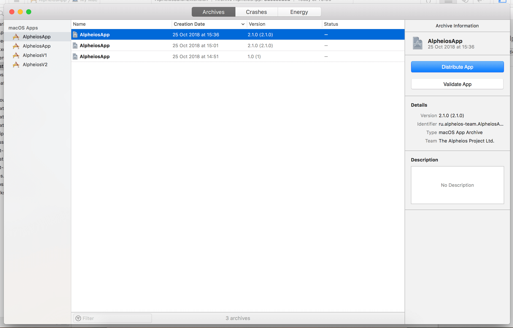
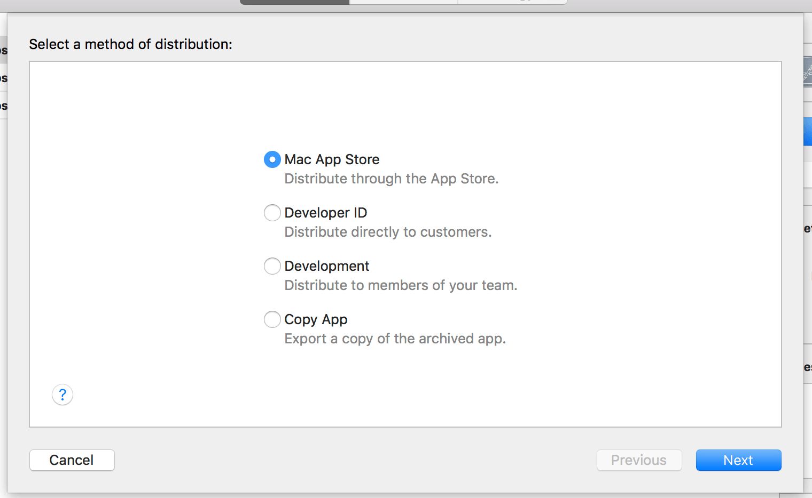
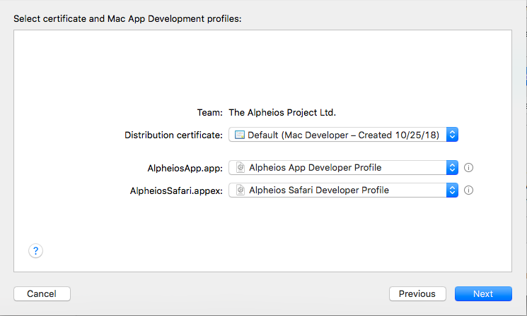
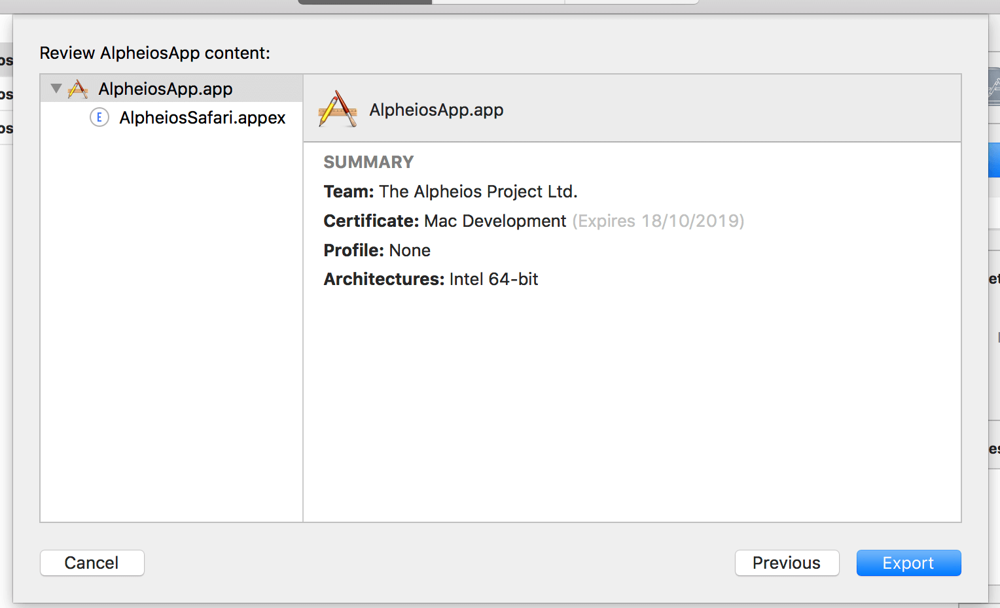
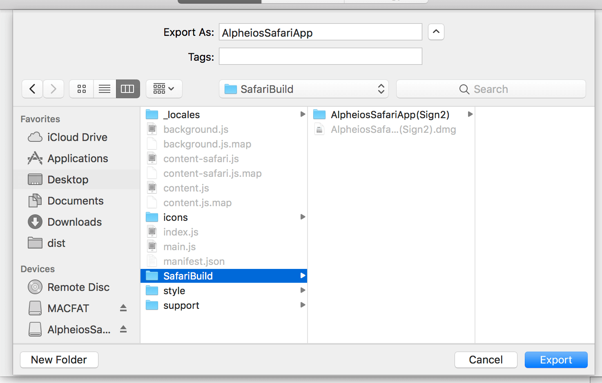
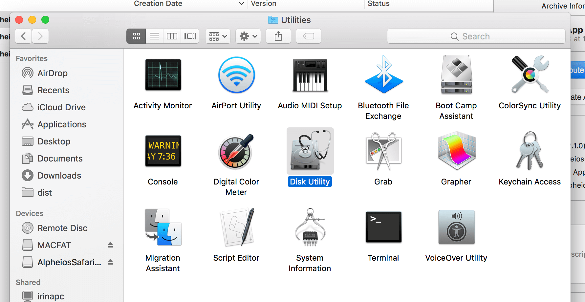
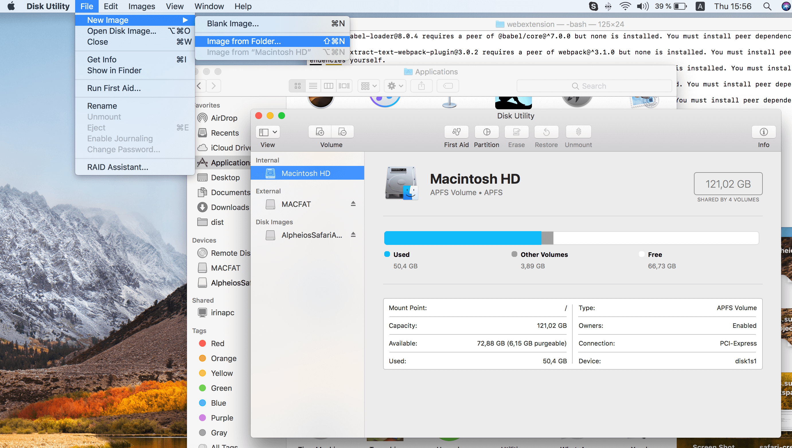
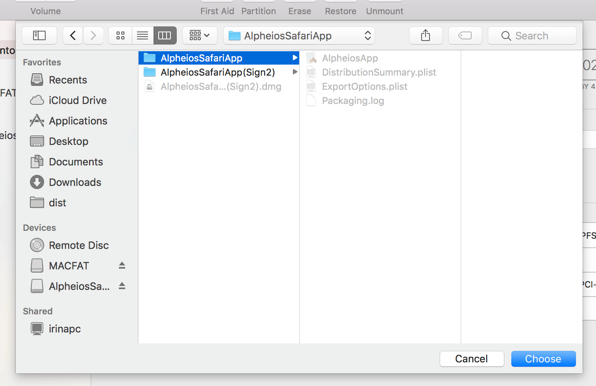
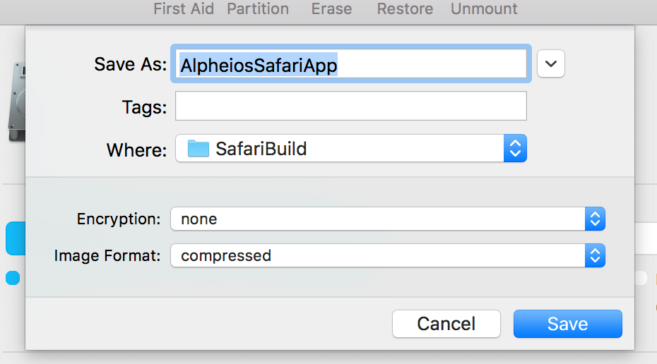

# How To Create a Build (all steps)

The update and build process for Safari App Extension contains the following stages:

1) *(Optional)* Update content part (js, css files)
2) *(Optional)* Change version and rebuild MacOS application
3) Archive MacOS application
4) Pack MacOS application to .dmg file

## 1. Update content part (js, css files)

Js/Css files are made using a standard npm build process with using `config-content-safari.mjs` file and `alpheios-node-build` tool.

The command is `npm run build-safari` (details of steps and parameters you could see in the `package.json`, `scripts` section).

Entry file for starting a build process you could see in `config-content-safari.mjs` (webpack -> common -> entry).

Current versions of all used libraries you could see in `package.json`.

## 2. Change version and rebuild MacOS application

It is recommended to keep the version and build numbers consistent across the App and the App Extension.

Increment the build number (CFBundleVersion) with each build for testing.

Increment the version number (CFBundleShortVersionString) with each release.

### Info.plist

Alpheios Safari App Extension consists of Application and Safari Extension. 
Each of them has its own `Info.plist` file with the following fields that can be used for identification process ([apple doc](https://developer.apple.com/library/archive/documentation/General/Reference/InfoPlistKeyReference/)):

Field name (XCode) | Field Key | Description
------------ | ------------- | -----------------
Bundle name | CFBundleName | Specifies the short name of the bundle, which may be displayed to users in situations such as the absence of a value for CFBundleDisplayName. This name should be less than 16 characters long.
Bundle Display name | CFBundleDisplayName | Specifies the display name of the bundle, visible to users and used by Siri
Executable file | CFBundleExecutable | Name of the bundle’s executable file.
Bundle identifier | CFBundleIdentifier | An identifier string that specifies the app type of the bundle. The string should be in reverse DNS format using only the Roman alphabet in upper and lower case (A–Z, a–z), the dot (“.”), and the hyphen (“-”).
Bundle version | CFBundleVersion | The build-version-number string for the bundle.
Bundle versions string, short | CFBundleShortVersionString | The release-version-number string for the bundle.
Bundle OS Type Code | CFBundlePackageType | The four-letter code identifying the bundle type. The type code for apps is APPL; for frameworks, it is FMWK; for loadable bundles, it is BNDL.
Copyright (human-readable) | NSHumanReadableCopyright | This key contains a string with the copyright notice for the bundle; for example, © 2016, My Company. You can load this string and display it in an About dialog box. The system uses this string in the app’s Info window in Finder.
NSHumanReadableDescription | NSHumanReadableDescription | When the app extension is installed, the string value of this key appears in Safari Extensions Preferences.

### Xcode parameters

Also Project and each target have their own scope of properties that are used in creation build, identifying and signing processes.

Project and Targets (to open properties click on a **AlpehiosSafariExtension** in the left panel):

Section | Field Name | Description
------------ | ------------- | -----------------
Packaging | Info.plist File | The project relative path to the property list file that contains the 'Info.plist' information used by bundles.
Packaging | Product Bundle Identifier | A string that uniquely identifies the bundle (reverse DNS format)
Packaging | Product Module Name | The name to use for the source code module constructed for this target, and which will be used to import the module in implementation source files.
Packaging | Product Name | This is the base name of the product generated by the target (used for Bundle name)
Signing | Code Signing Identity | The name of the valid code-signing certificate in a keychain within your keychain path. A missing or invalid certificate will cause a build error.
Signing | Development Team | The team ID of a development team to use for signing certificates and provisioning profiles.
Signing | Provisioning Profile | Must contain a profile name (or UUID).
Versioning | Current Project Version | This settings defines the current version of the project.

### Rebuild process has the following steps:

1) **Product -> Clean Build Folder**
2) **Product -> Build**

## 3. Archive MacOS application - Development Build

For make an archive of the application:

1. Click **Product -> Archive**
   In the left Panel you will see all saved builds for macOS Apps, when you choose the one of them at the right panel you will be able to see the Details:

   

2. Click **Distribute App**, select **Development** and click **Next**

   

3. Make sure the Team on the signing page is The Alpheios Project, Ltd. and choose your Mac Developer certificate, then the select the **Alpheios App Developer Profile** profile for the Alpheios App and the **Alpheios Safari Developer Profile** for the Alpheios Safari App Extension and click **Next**

   

4. You will be shown the screen with final properties, click **Export**

   

5. Define Archive Folder name and click **Export**

   

Finally you should have the ready folder in SafariBuild with AlpheiosSafariApp (names from my example).

## 4. Pack MacOS application to .dmg file

For creating .dmg from archive application folder:

1. Open Applications -> Utilities -> Disk Utility

   

2. Click File -> New Image -> Image from Folder

   

3. Choose created archive application folder and click **Chose**

   

4. Click **Save** (in this dialog window you could define dmg file name)

   

DMG file is ready.
